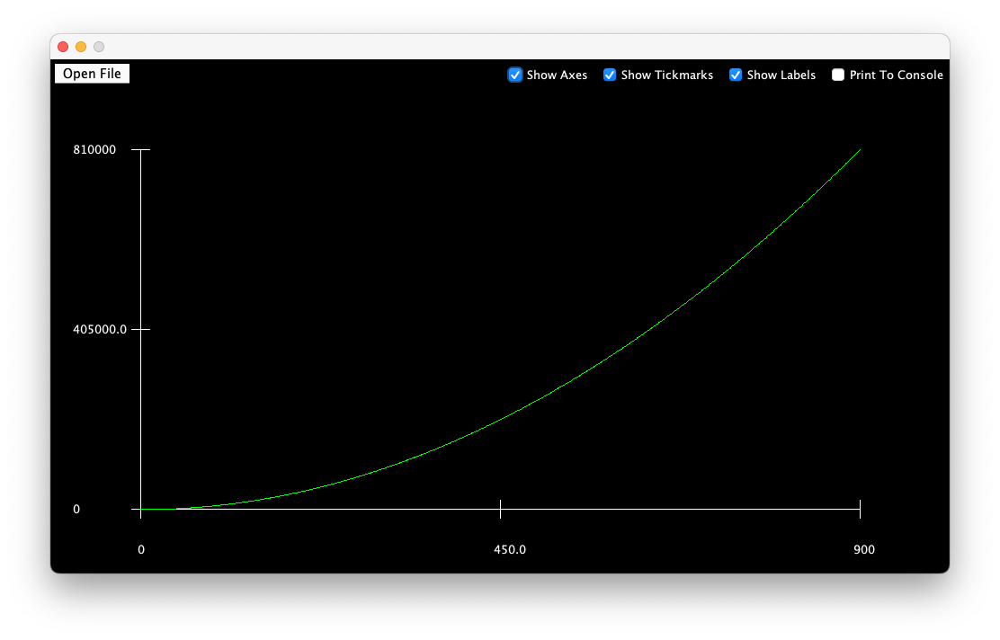

# DataGrapher

### About:
- This program helps to visualize data by graphing a set of x and y values provided in a .txt file.
- It automatically scales the points to fit within a certain grid size.
- It can be used to visualize an equation, but the axes will most likely be innacurate.[^bignote]

- Comments are added if you would like to understand how the code works or make changes.

### Running the program:
1. Clone the repository, download the code, or copy/paste it into a .java file. Make sure there is at least one .txt file with correctly formatted data.
2. Run the Graphing.java file.

### Other notes:
- This program only graphs positive numbers.
- There is a certain range of numbers, and really large numbers might cause some bugs.

[^bignote]: Since you have to enter the x and y values in a .txt file to graph an equation, it will be hard
    to calculate those points yourself and enter them in manually. For this, the [GetDataPoints.java](https://github.com/KrishayB/DataGrapher/blob/main/GetDataPoints.java) file exists.
      The field variable `LENGTH` should be set to the number of data points needed. Right now, it is set to 100 data points.
      The first for-loop will print the x-coordinates. If you want different x-coordinates, you can change it.
      The equation can be changed in the first method. The current equation is 200cos(x) + 200.
